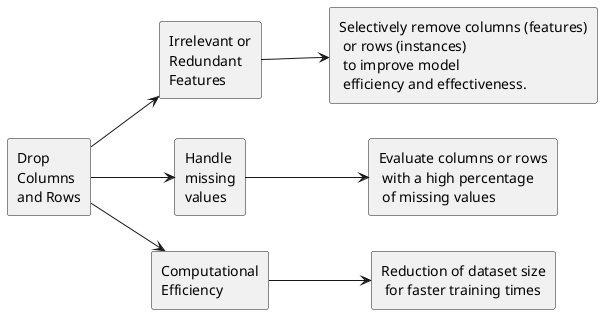
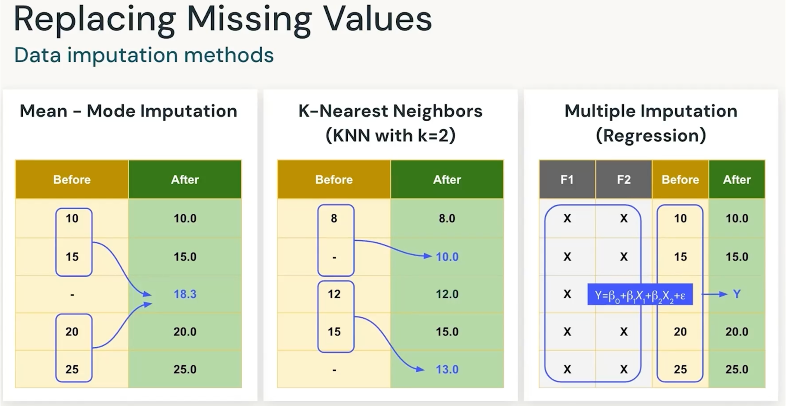
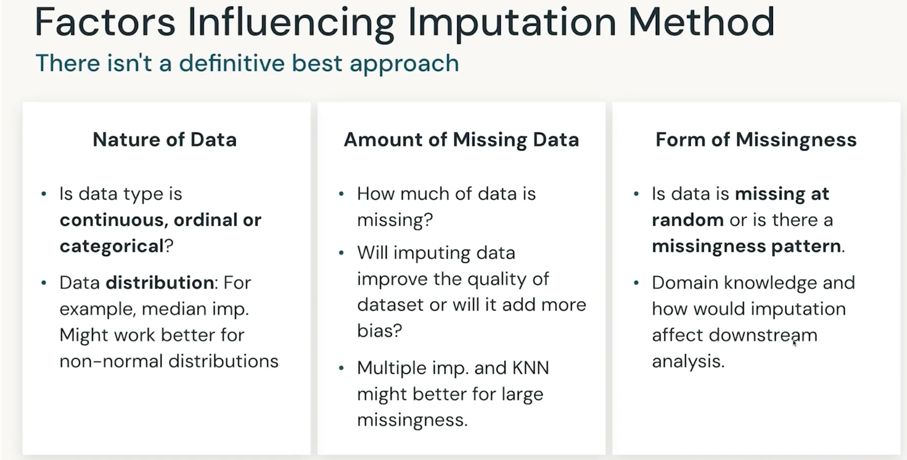
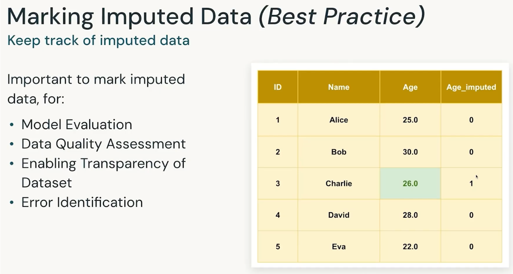
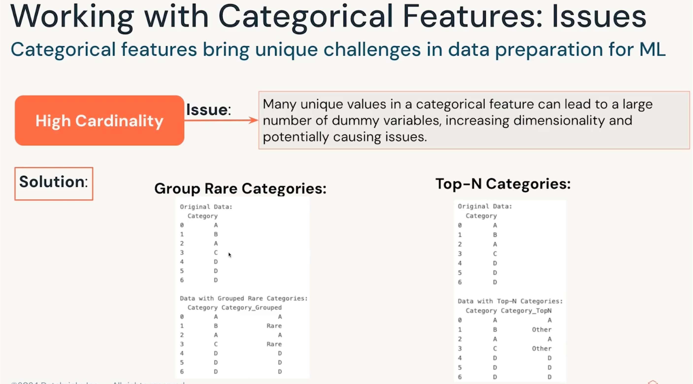
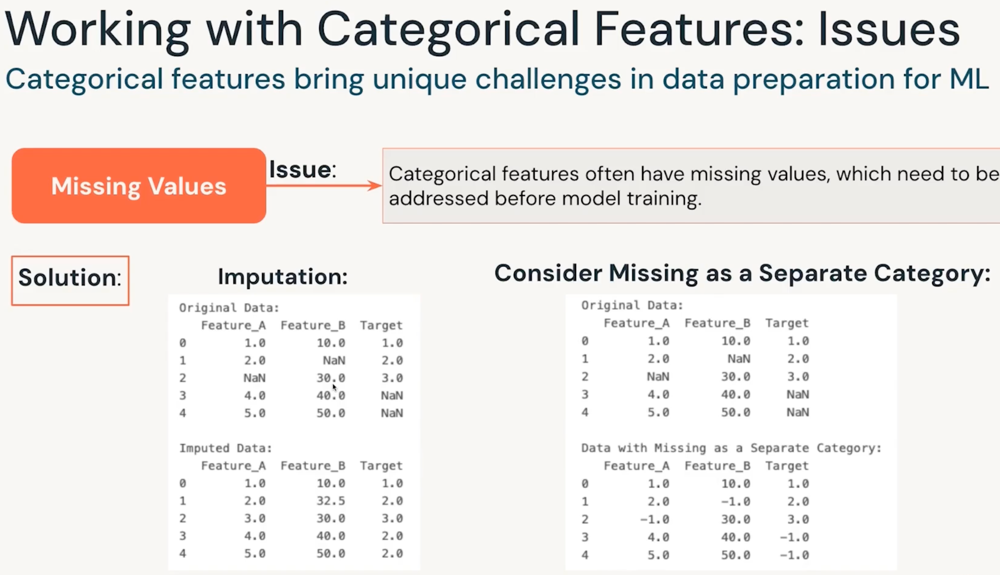
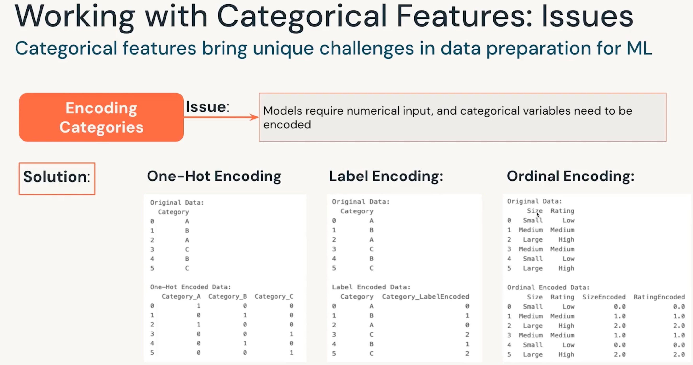

# Data Preparation for ML projects
## Goal: Optimize input quality for accurate model predictions

Data preparation includes the following tasks:
- Cleaning and formatting data: This includes tasks such as handling missing values or outliers, ensuring data is in the correct format,
and removing unneeded columns.
- Feature Engineering: This includes tasks like numerical transformations, aggregating data, encoding text or image data, and creating new features.
[title](../img/data_prep_and_feature_eng_00.png)

## Feature Engineering
Transforming raw data into model-friendly features
- It is a critical step in preparing data for machine learning models.
- It transforms raw data into a format that allows ML models to extract meaningful patterns and make accurate predictions.
[title](../img/data_prep_and_feature_eng_01.png)
## Feature Extraction
Transforming raw data into a set of features that better represent the underlying patterns
- Transforming Raw Data for Enhanced Modeling
- Dimensionality Reduction for Improved Performance
- Simplifying Feature Engineering
[title](../img/data_prep_and_feature_eng_02.png)
## Feature Selection: Dropping Columns/ Rows
- Enhancing Model Efficiency
- Streamlining the dataset by:
1. Selectively remove columns (features) or rows (instances) to improve model efficiency and effectiveness.
2. Irrelevant or Redundant Features: Remove features that do not contribute significantly to the prediction task or are highly correlated with other features.
3. Handle missing values: Evaluate columns or rows with a high percentage of missing values.
4. Computational Efficiency: Reduction of dataset size for faster training times.

[title](../img/data_prep_and_feature_eng_03.png)

## Why do we need data splitting
Optimizing Model Evaluation
1. Training and Testing
2. Avoiding Overfitting
3. Hyperparameter tuning
4. Preventing data leakage
```plantuml
rectangle "Data Splitting" as split
rectangle "Training and Testing" as train
rectangle "Avoiding Overfitting" as avoid
rectangle "Hyperparameter tuning" as tune
rectangle "Preventing data leakage" as leak

split --> train
split --> avoid
split --> tune
split --> leak


```
## Splitting Data into Multiple Sets
- Optimizing Model Training, Validation, and Testing
- Splitting the dataset is a fundamental step in data preparation to facilitate effective  model training, validation, and testing.
[title](../img/data_prep_and_feature_eng_04.png)
```plantuml
rectangle "Input Dataset" as input
rectangle "Training Dataset (full)" as train_1
rectangle "Testing Dataset" as test_1
rectangle "Training Dataset (split)" as train_2
rectangle "Validating Dataset" as validate
rectangle "Testing Dataset (unchanged)" as test_2

input --> train_1
input --> test_1
train_1 --> train_2
train_1 --> validate
test_1 --> test_2
```
[title](../img/data_prep_and_feature_eng_05.png)

## Sampling Methods
1. Random Sampling
2. Stratifid sampling
3. Cluster sampling

4. [title](../img/data_prep_and_feature_eng_06.png)

## Cross-Validation
Cross-validation is a resampling technique used to assess the performance of a machine  learning model.
It involves partitioning the dataset into subsets to train and evaluate the model multiple times, providing a more robust estimate of its generalization performance.
Here are the key elements of cross-validation:
- K-Fold Cross-Validation
- Stratified K-Fold Cross-Validation
- Shuffle Split Cross-Validation
- Nested Cross-Validation

```plantuml
left to right direction
rectangle "1. 6 , 8 \n 2, 2, 5 \n 4, 6, 9 " as input

rectangle "Cross-Validation" {
    rectangle model_1_training
    rectangle model_2_training
    rectangle model_3_training
}
rectangle best_model
input --> model_1_training
input --> model_2_training
input --> model_3_training
model_1_training --> best_model
model_2_training --> best_model
model_3_training --> best_model
```

[title](../img/data_prep_and_feature_eng_07.png)

## Sampling for Time-Series Data
Sampling for time-series data requires special consideration due to the
temporal dependencies inherent in the data. Traditional random sampling
or shuffling may not be appropriate, as the order of events in time is
crucial.
[title](../img/data_prep_and_feature_eng_08.png)


## Data Imputation
Data imputation is the process of filling in
missing values in a dataset with estimated
or predicted values.
The goal of data imputation is to enhance
the quality and completeness of the
dataset, ultimately improving the
performance and reliability of the machine
learning model.
[title](../img/data_prep_and_feature_eng_09.png)

## Problems with Missing Data
- Impacting the performance and reliability of ML models
- Reduced Model Performance
- Biased Inferences
- Imbalanced Representations
- Increased Complexity in Model Handling
- [NEED TO SEE EXPLORATION WINDOW]
[title](../img/data_prep_and_feature_eng_10.png)

## How to Handle Missing Data
Data imputation methods
```plantuml
rectangle "Missing Data" as missing
rectangle "Drop rows/columns" as drop
rectangle " Treat as Category" as tx
rectangle "Replace missing values" as replace
rectangle row_wise
rectangle column_wise
rectangle "encode as \naseparate\nvariable" as encode
rectangle mean_imputation
rectangle mode_imputation
rectangle median_imputation
rectangle KNN_imputation
rectangle Regression_imputation

missing --> drop
missing --> tx
missing --> replace

drop --> row_wise
drop --> column_wise
tx --> encode
replace --> mode_imputation
replace --> mean_imputation
replace --> median_imputation
replace --> KNN_imputation
replace --> Regression_imputation
```
[title](../img/data_prep_and_feature_eng_11.png)

## Replacing Missing Values
Data imputation methods


## Factors Influencing Imputation Method
There isn't a definitive best approach


## Marking Imputed Data (Best Practice)
Keep track of imputed data


## Working with Categorical Features: Issues (High Cardinality)
Categorical features bring unique challenges in data preparation for ML


## Working with Categorical Features: Issues (Missing Values)
Categorical features bring unique challenges in data preparation for ML


## Working with Categorical Features: Issues (Encoding Categories)
Categorical features bring unique challenges in data preparation for ML

